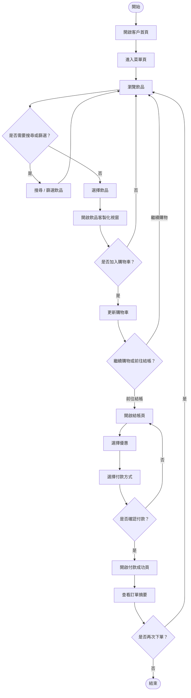

# 客戶活動圖

```mermaid
flowchart TD
    START([開始]) --> LANDING["開啟客戶首頁"]
    LANDING --> MENU["進入菜單頁"]

    MENU --> BROWSE["瀏覽飲品"]
    BROWSE --> FILTER{"是否需要搜尋或篩選？"}
    FILTER -->|是| SEARCH["搜尋 / 篩選飲品"]
    SEARCH --> BROWSE
    FILTER -->|否| SELECT["選擇飲品"]

    SELECT --> CUSTOMIZE["開啟飲品客製化視窗"]
    CUSTOMIZE --> DECIDE{"是否加入購物車？"}
    DECIDE -->|否| BROWSE
    DECIDE -->|是| CART["更新購物車"]

    CART --> REVIEW{"繼續購物或前往結帳？"}
    REVIEW -->|繼續購物| BROWSE
    REVIEW -->|前往結帳| CHECKOUT["開啟結帳頁"]

    CHECKOUT --> PROMO["選擇優惠"]
    PROMO --> PAYMENT["選擇付款方式"]
    PAYMENT --> CONFIRM{"是否確認付款？"}
    CONFIRM -->|否| CHECKOUT
    CONFIRM -->|是| SUCCESS["開啟付款成功頁"]

    SUCCESS --> SUMMARY["查看訂單摘要"]
    SUMMARY --> AGAIN{"是否再次下單？"}
    AGAIN -->|是| BROWSE
    AGAIN -->|否| END([結束])
```
